## Step-1

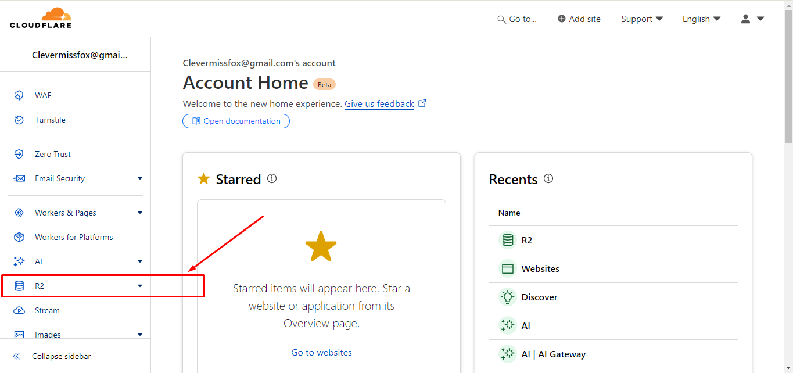

## Step-2

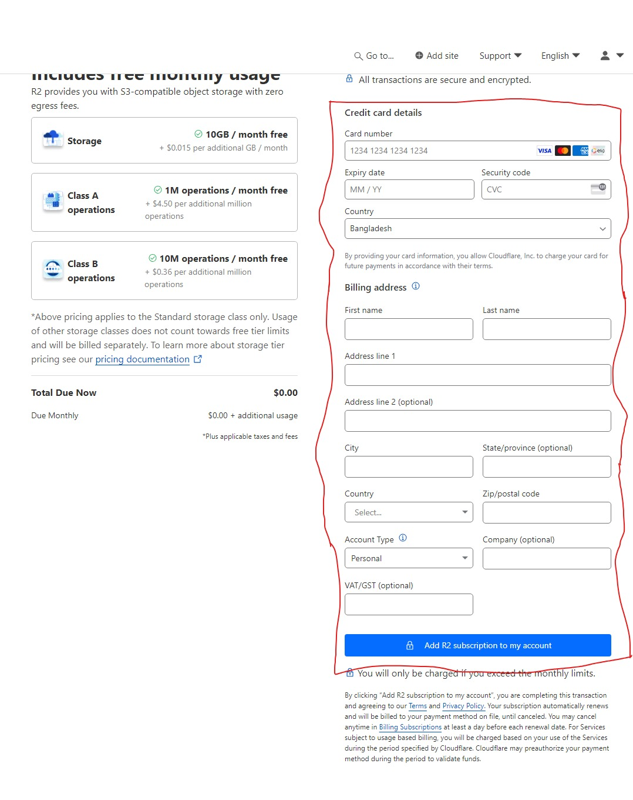

## Step-3

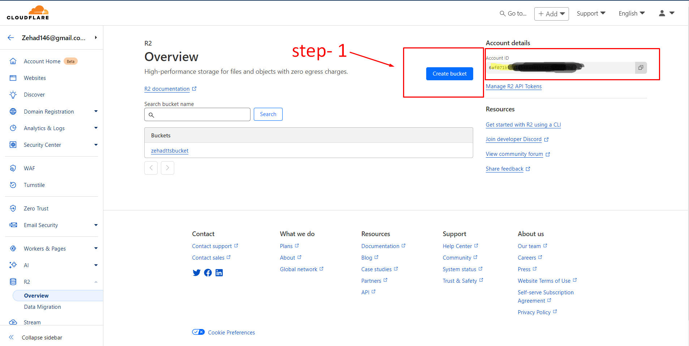

## Step-4

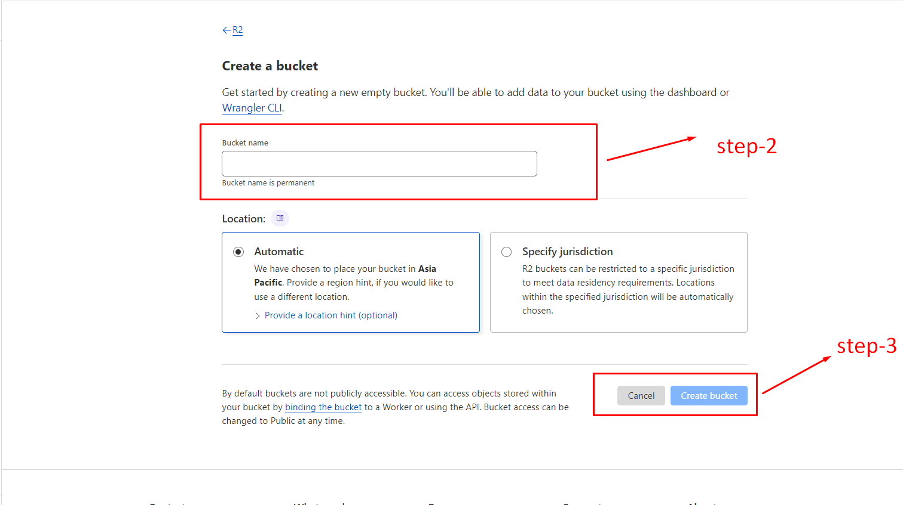

## Step-5

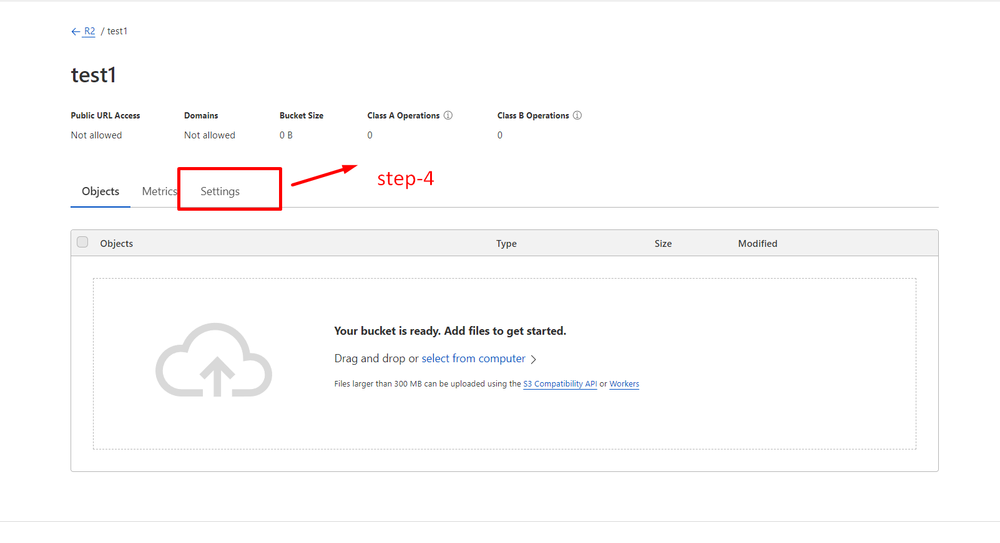

## Step-6

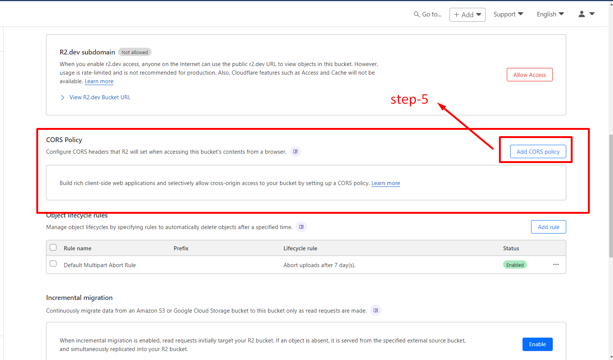

## Step-7

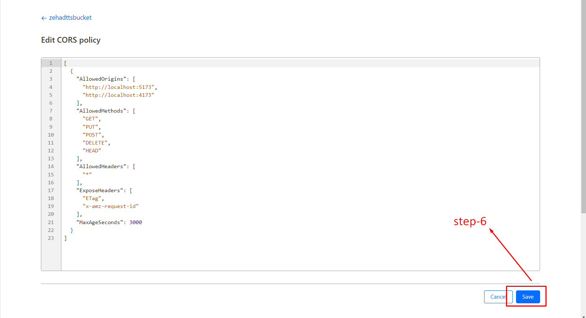

## Step-8

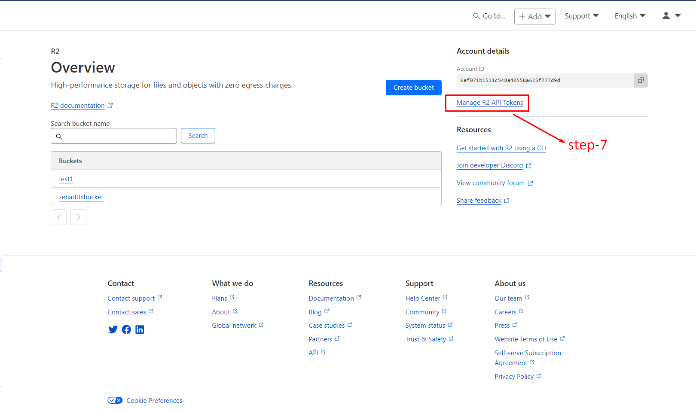

## Step-9

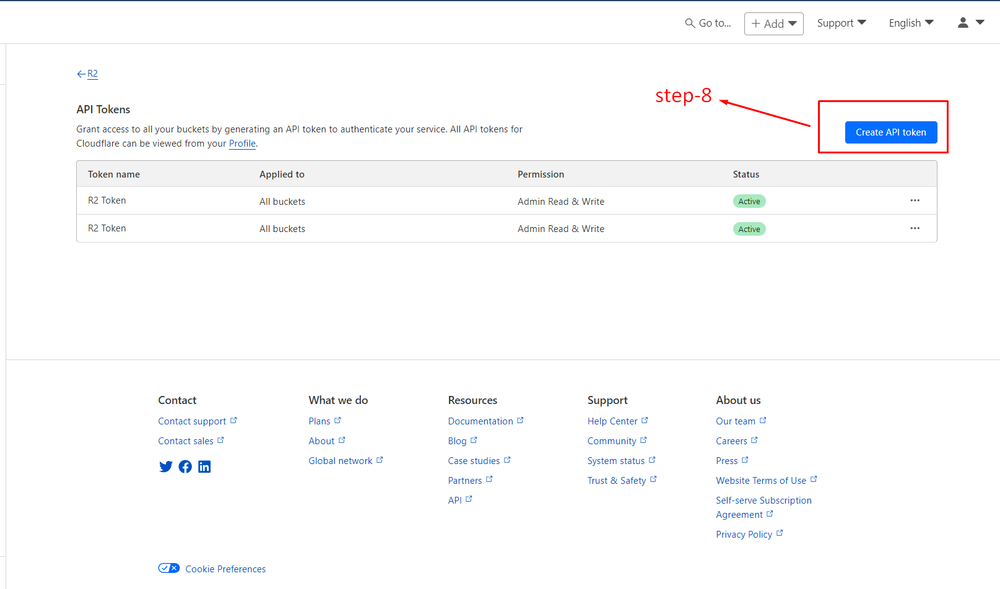

## Step-10

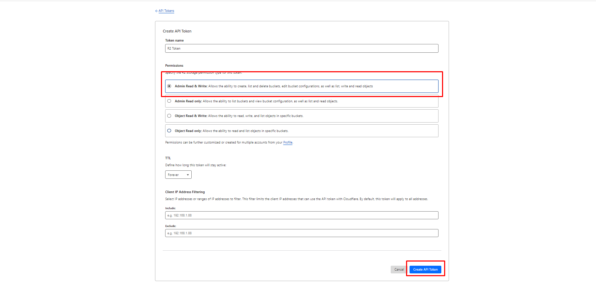

## Step-11

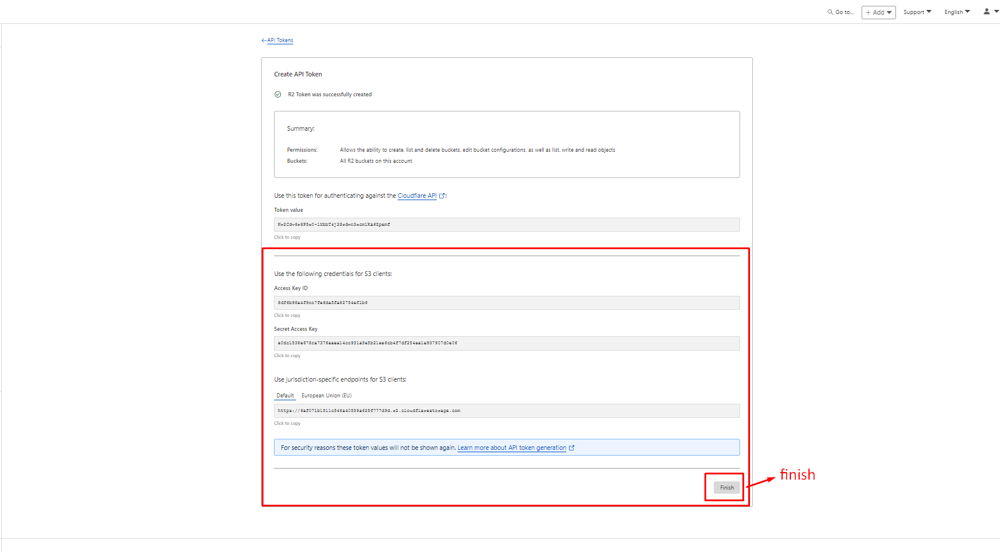

## Step-12

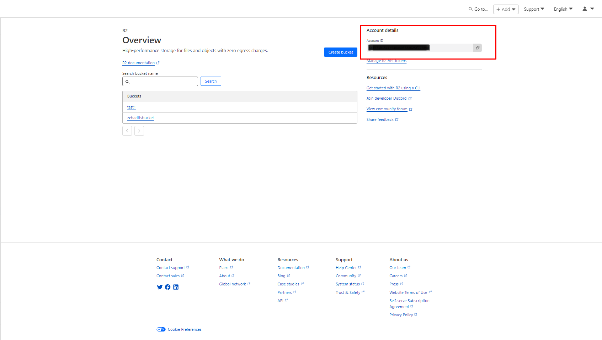

## Your Audio Stored Here

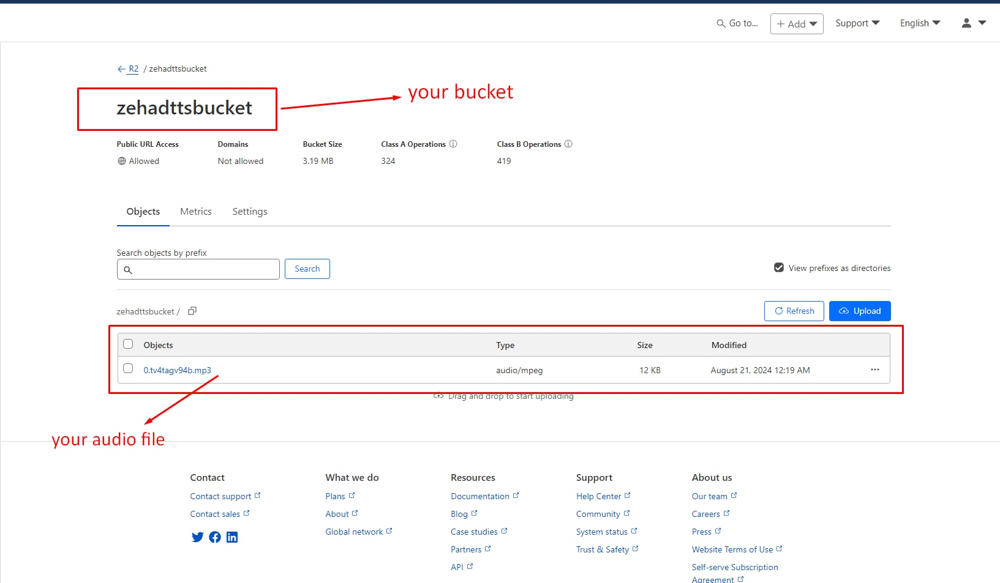

## Getting Public Bucket URL

Click on your bucket name (e.g. `missfox`) and navigate to 'Settings', scroll down to `R2.dev subdomain` section where you will enable access and retrieve the value of `Public R2.dev Bucket URL`; This is what the value of the environment variable `VITE_PUBLIC_R2_BUCKET_URL` will be 

##Deployed on Cloudflare Pages
